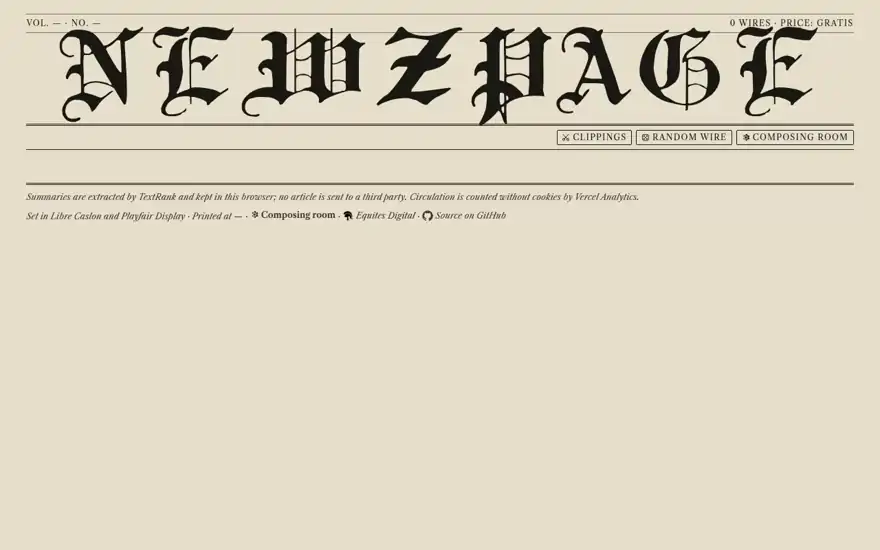
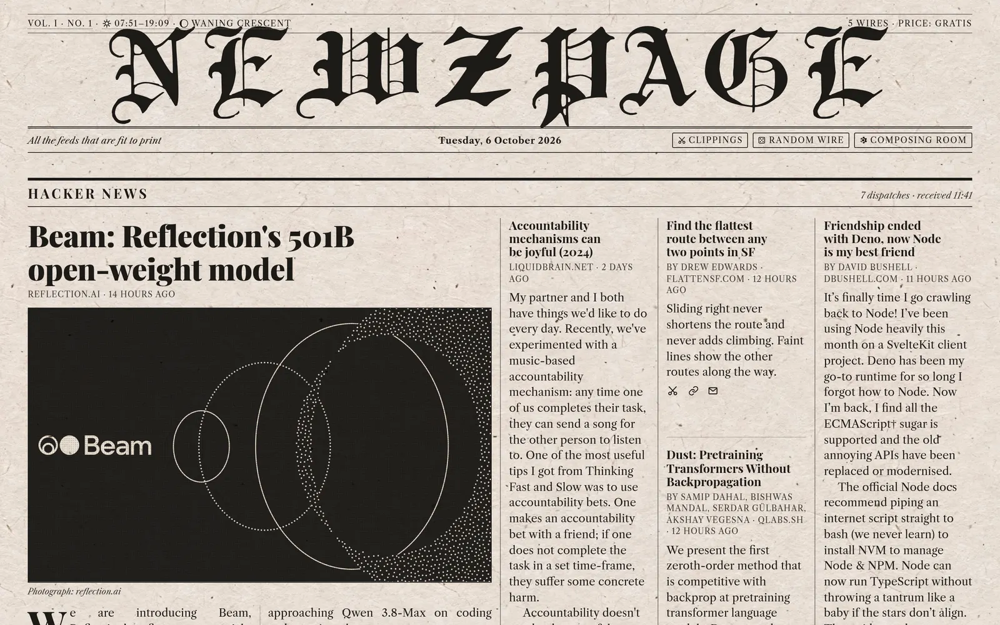

# Newzpage

**Your RSS feeds, printed as the front page of an old newspaper.**

Headlines in heavy serif type, a lead story with a halftone photograph, short items stacked in narrow columns, and
a masthead with the date, the edition number and the phase of the moon. Every story gets a few paragraphs of real
body copy, summarised from the article itself, so you can read the morning's news the way you would skim a paper
over coffee, then follow the stories worth more of your time.

Read it at **[newz.page](https://newz.page)**. There is nothing to sign up for.



## Why a newspaper?

Feed readers tend to look like email: a list of titles, unread counts, a pane to read in. That works for keeping up,
but it never felt like *reading the news*. A newspaper front page does something a list cannot. The layout tells you
what matters, you take in a dozen stories at a glance, and the summaries let you decide what deserves your attention
without opening a single tab.

I have wanted that reader for years, and this is my fourth attempt at building it. The earlier ones stumbled on the
same two problems:

- **The summaries.** Good summaries meant paying an external service (SMMRY, later OpenAI) for every article, with
  keys to manage and seconds of waiting per story. My own summariser worked, but not well enough.
- **The layout.** Every version ended up as a grid pretending to be a newspaper: the same box repeated down the page.

This version, built with the help of [Claude Code](https://claude.com/claude-code), finally solves both. The
summariser runs locally, costs nothing, and gets it right most of the time. The layout composes each section like a
compositor would: wide and narrow columns, stories stacked where they are short, photographs where they earn their
place, and every column filled to the same depth, so no two sections look alike.

## Your newspaper stays in your browser

There are no accounts. Everything about *your* paper lives in your own browser (in `localStorage`): which feeds you
read and in what order, the paper's title, your clippings, your almanac's place and the summaries already worked out.
Take it to another browser by exporting it as a file.

The server only does what a browser cannot do on its own: fetch feeds and articles from other sites, extract the text
and rank the sentences. It keeps a short-lived, in-memory cache of that public content so that many readers don't fetch
the same site over and over, and that cache is gone when the server restarts. It stores nothing about you. Page views
are counted with cookieless [Vercel Web Analytics](https://vercel.com/docs/analytics/privacy-policy).



## What you can do with it

- **Make it yours.** In the *composing room* (the settings page) you search for feeds by topic or site and add them in
  one click, paste any feed address, or import an OPML file from another reader. Rename wires, choose how many stories
  each one gets, drag them into order, and give your paper its own title and tagline.
- **Read further down a wire.** The *Older* button under each section prints the next stories as more of the page.
- **Discover something new.** *Random wire* prints a single feed drawn from a directory of about 200 well-known ones.
- **Keep clippings.** The scissors under a story keep it in your scrapbook, typeset like a wire of its own. A clipping
  keeps its own copy of the text, so it stays readable long after the story has left the feed.
- **Share a cutting.** The link under a story copies the address of a page with that one story on it, and pasted into
  a chat it unfurls as a picture of a newspaper cutting.
- **Check the almanac.** Pick your city (or let the browser tell it) and the masthead's ear shows today's sunrise,
  sunset and the moon's phase, worked out in the browser.

## How the summaries work

No AI service is involved, and no article is sent to a third party. The server takes the article's text (from the feed
when it carries the full text, otherwise from the page, cleaned up with Mozilla's Readability) and ranks its sentences
with [TextRank](https://en.wikipedia.org/wiki/Automatic_summarization#TextRank_and_LexRank), tuned for the way news is
written: earlier sentences and sentences that echo the headline count for more, and quotes, questions and sentences
that lean on the one before ("He said…", "This means…") count for less. The page then prints as many of the best
sentences as each block on the page has room for, in their original order and word for word.

It takes a few milliseconds per article. It is not perfect: some sites block it or need JavaScript to show their text.
Then the story falls back to the feed's own description.

## Run it yourself

```bash
npm install
npm run dev        # http://localhost:3000
```

It needs Node.js 24. `feeds.json` holds the *house defaults*, the wires a first-time visitor starts with; from then on
each reader's own copy rules:

```json
{
  "title": "Newzpage",
  "tagline": "All the feeds that are fit to print",
  "itemsPerFeed": 10,
  "feeds": [
    { "name": "BBC News", "url": "https://feeds.bbci.co.uk/news/rss.xml", "limit": 11 },
    { "url": "https://news.ycombinator.com/rss" }
  ]
}
```

Settings such as the feed search's reach and private-network access are documented in `.env.example`.

| Command | What it does |
| --- | --- |
| `npm test` | Unit tests (Node's built-in runner, via `tsx`) |
| `npm run typecheck` / `npm run lint` | TypeScript and ESLint |
| `npm run build && npm start` | Production build and server |
| `npm run summarize -- <url> [--words 120]` | Summarise any article from the command line, with timings and the top-ranked sentences |
| `npm run directory` | Rebuild the bundled feed directory from the curated list, keeping only feeds that work |

## Under the hood

The rest of this file is for anyone who wants to work on the code.

### How an edition is composed

The page is a static shell; the browser composes the edition:

1. **Configuration** is read from `localStorage` (a first visit fetches `/api/defaults` once and keeps it).
2. **Feeds** come from `/api/feed?url=…&limit=…`. The server fetches each feed with a conditional request
   (ETag / Last-Modified), parses RSS 2.0, Atom 1.0 and RSS 1.0 into one shape, and keeps the result in memory for the
   feed's own `ttl` (5 minutes to 6 hours; 15 minutes when unspecified), serving the last copy, marked stale, when a
   refresh fails.
3. **Summaries** come from the browser's cache, otherwise from `/api/article?url=…&feed=…`. Pages are fetched with a
   12 s timeout and a 3 MB cap. The result is a ranked analysis rather than a fixed-length summary, so any block size
   can be composed from it.
4. **Photographs** are chosen from Media RSS, enclosures, inline images, `og:image` and `twitter:image`, with tracking
   pixels, logos, icons and banner-shaped images filtered out.
5. **Layout**: the page maker (`src/lib/edition/pagemaker.ts`) sets each section in full-width bands. The lead story
   sets the first band's height; later bands are cut into slots of varying column spans, seeded from the story ids so
   the page looks the same on every reload. Word budgets are estimated from a height model, then corrected from the
   rendered heights before paint (`fitBudgets`), so every slot reaches the band's depth. Photographs are rationed to
   about one story in three.
6. **Print**: photographs become halftones with CSS filters, multiplied over the paper texture with a dot screen.

### The summariser

`src/lib/summarize` segments text with `Intl.Segmenter` (repairing the splits ICU gets wrong, such as "Dr. Smith"),
cleans out boilerplate, citation markers, bios and fragments, and detects the language from stopword density
(English, Dutch, German and French). Sentences become TF-IDF vectors, cosine similarity forms a graph, and PageRank
gives each sentence's centrality, which is multiplied by the news-specific priors described above. Maximal marginal
relevance orders the picks so a second sentence about the same fact does not push out one about a different fact.
`compose()` runs in the browser and walks that order until a block's word budget is spent.

### Storage

| Key | Contents |
| --- | --- |
| `newzpage.config.v1` | title, tagline, feeds in order with their story counts |
| `newzpage.articles.index.v1` | index of cached analyses: size, last use, expiry |
| `newzpage.article.v1.<hash>` | one cached analysis per article |
| `newzpage.clippings.v1` | the reader's clippings: each story as printed, its wire, and when it was clipped |
| `newzpage.almanac.v1` | the almanac's place: latitude and longitude to a hundredth of a degree, a name, and a time zone |
| `newzpage.reader.v1` | when this browser first printed an edition, how many it has printed, and the last edition's fingerprint |

The summary cache is rolling: at most 400 entries and about 3 MB, least recently used first out. Entries expire after
30 days, or after an hour when only the feed's description was available. Bumping `SUMMARIZER_VERSION` in
`src/lib/summarize/types.ts` invalidates them all.

### Deploying

The app runs anywhere Next.js runs; [newz.page](https://newz.page) is on Vercel.

- **Node.js 24** is required (`"engines": { "node": "24.x" }`); older runtimes cannot load jsdom's dependencies.
- **Function duration**: fetching and extracting an article can take longer than ten seconds, so the API routes
  declare `maxDuration` (60 s for articles).
- **Analytics**: remove `<Analytics />` from `src/app/layout.tsx` when deploying elsewhere.
- **Feed search** asks feedly.com's public search alongside the bundled directory; set `NEWZPAGE_FEED_SEARCH=directory`
  to keep searches in-house.
- **Safety**: because the server fetches addresses readers type in, it refuses anything that resolves to a loopback,
  link-local or private address, checking every redirect (`NEWZPAGE_ALLOW_PRIVATE_URLS=1` lifts this on a home
  network). The API is unauthenticated, so put a rate limiter in front of a public deployment.

### Layout of the code

```
feeds.json                    house defaults for first-time readers
src/app                       Next.js entry: layout, the front page, styles
src/app/api                   feed, article, search and defaults endpoints (the only server work)
src/app/settings              the composing room
src/app/random, src/app/wire  a single wire, drawn at random or chosen by address
src/app/clippings             the scrapbook
src/app/story                 a cutting: one story on its own page, with a server-drawn preview image
src/components                masthead, sections, stories, photographs, colophon
src/lib/client                localStorage stores, the rolling summary cache, API client, hooks
src/lib/feeds                 feed fetching and parsing, feed search, OPML
src/lib/articles              page fetching, Readability extraction, photograph selection
src/lib/summarize             segmentation, language detection, TextRank, analyse and compose
src/lib/almanac               sunrise and sunset, the moon's phase, the list of cities
src/lib/edition               edition builder and the page maker
src/lib/cache, src/lib/util   in-memory cache, HTTP helpers with the address guard, text and time
scripts/build-directory.ts    curated candidate list → validated directory.json
```

### Known limits

- Sites that block non-browser clients or need JavaScript to render fall back to the feed description.
- Summaries are extractive: sentences are quoted verbatim, never rewritten. Long reads are summarised from their first
  400 sentences.
- Stopword lists exist for English, Dutch, German and French; other languages are ranked without them.
- A browser that blocks storage (some private windows) still works, but forgets everything when the tab closes.

## Fonts

Masthead: Traditional Gothic (Dieter Steffmann). Headlines: Playfair Display (OFL). Body: Libre Caslon Text (OFL). All
are served from `src/fonts`; nothing is loaded from third parties at runtime.

## License

Newzpage is free software under the [GNU Affero General Public License v3.0](LICENSE). You may run it, study it,
change it and share it. If you run a modified copy as a service others use over a network, you must offer those users
its source code under the same license.

If you would like to build on Newzpage commercially without those terms, a separate commercial license is available:
get in touch through [Equites Digital](https://equites.digital).

The fonts in `src/fonts` are not covered by this license; each keeps its own (the SIL Open Font License for Playfair
Display and Libre Caslon Text, the author's terms for Traditional Gothic).
